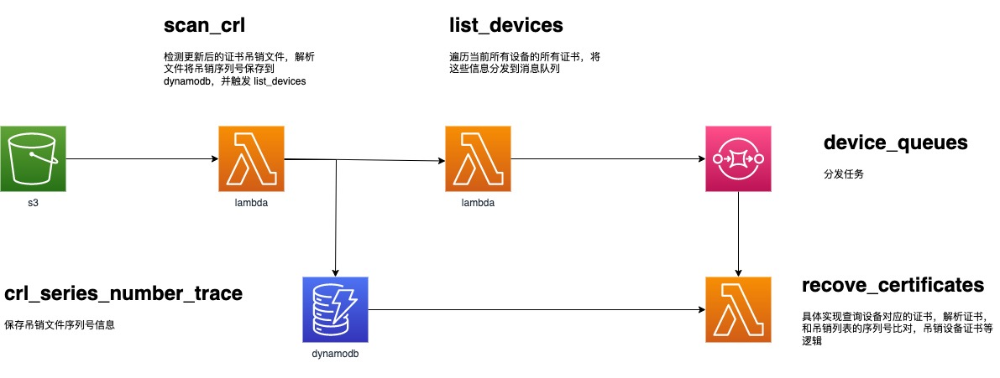

# iot-device-certicate-revoke
## 架构及流程

## 前提
创建一个sqs负责分发
修改三个python 文件的注释部分。
## 快速部署
1. 创建两个ecr repo,请参考官方文档

2. 使用DockerRevokeCertificates, DockerScanCrl 分别构建docker并推送到ecr repo
3. revoke_certificates, 和 scan_crl使用docker镜像方式部署lambda,请参考官方文档
4. list_devices 使用普通lambda方式部署
