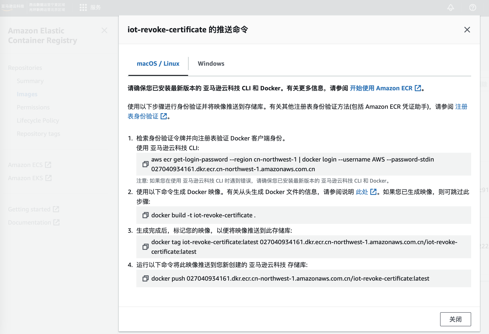
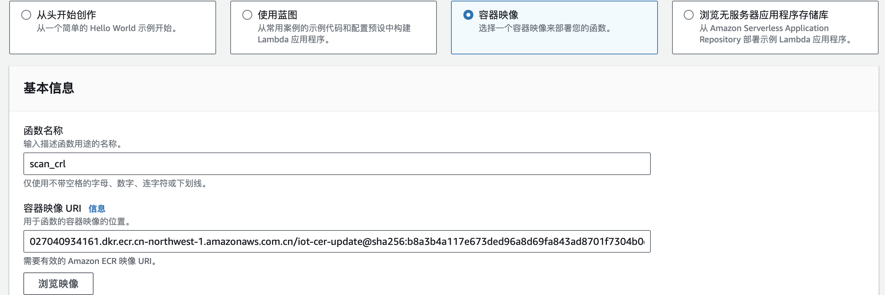
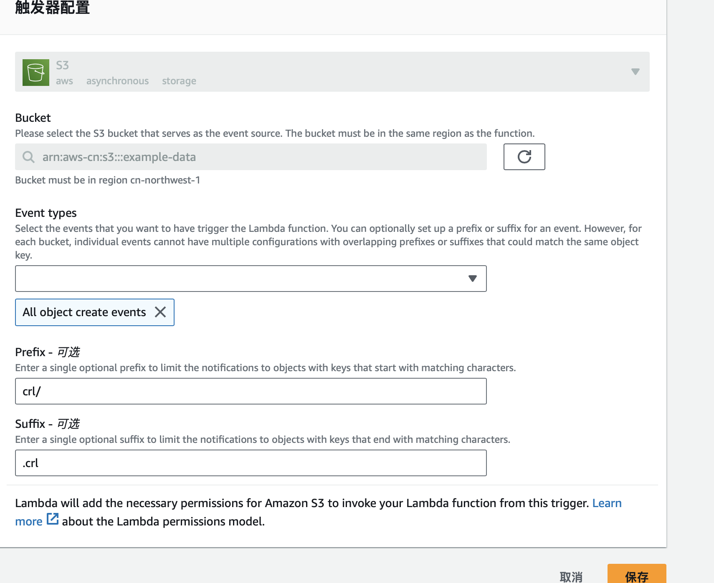
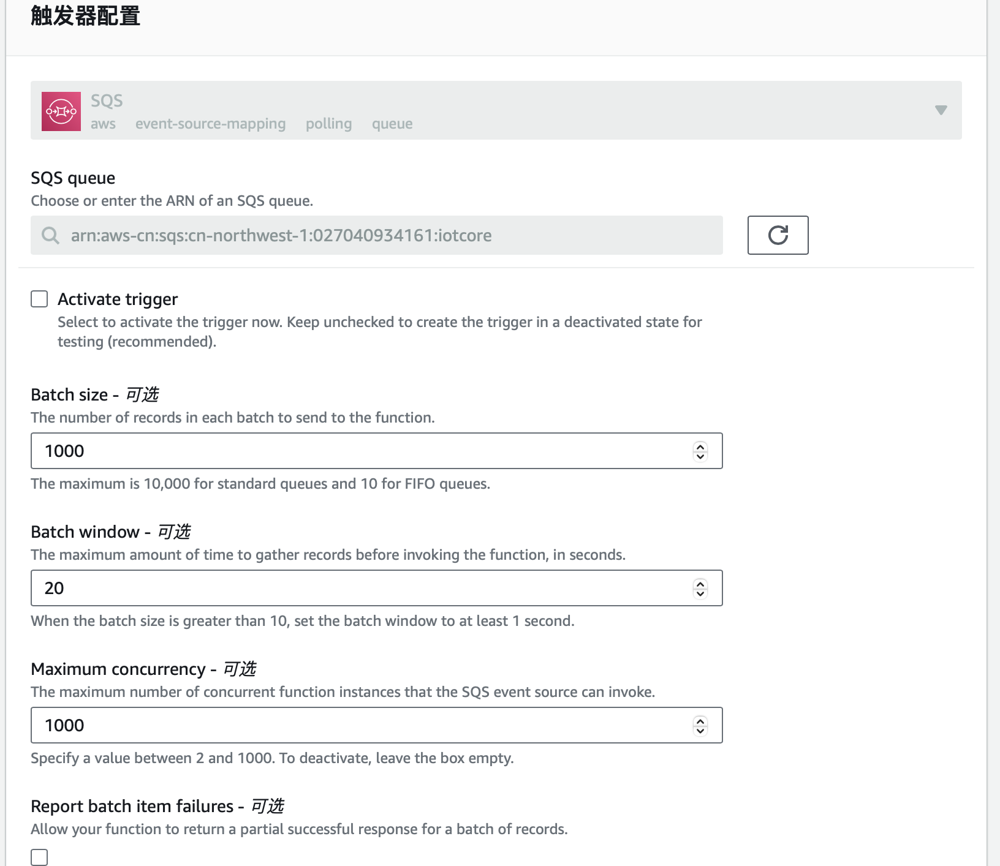

# iot-device-certicate-revoke
## 架构及流程


## 前提
创建一个sqs负责分发
修改三个python 文件的注释部分。
## 快速部署
1. 创建两个ecr repo,请参考官方文档
2. 使用DockerRevokeCertificates, DockerScanCrl 分别构建docker并推送到ecr repo

其中build docker的时候要分别指定DockerRevokeCertificates, DockerScanCrl
```
docker build -t iot-revoke-certificate . -f DockerRevokeCertificates

docker build -t iot-revoke-certificate . -f DockerScanCrl
```
3. revoke_certificates, 和 scan_crl使用docker镜像方式部署lambda,[请参考官方文档](https://docs.aws.amazon.com/zh_cn/lambda/latest/dg/images-create.html)


4. 配置lambda scan_crl函数,添加s3触发器

s3trigger

4. 配置lambda revoke_certificates,添加sqs触发器

s3trigger
4. list_devices 使用普通lambda方式部署

## 使用方式
请参考架构图中的描述，在配置的s3中，上传crl吊销证书文件
